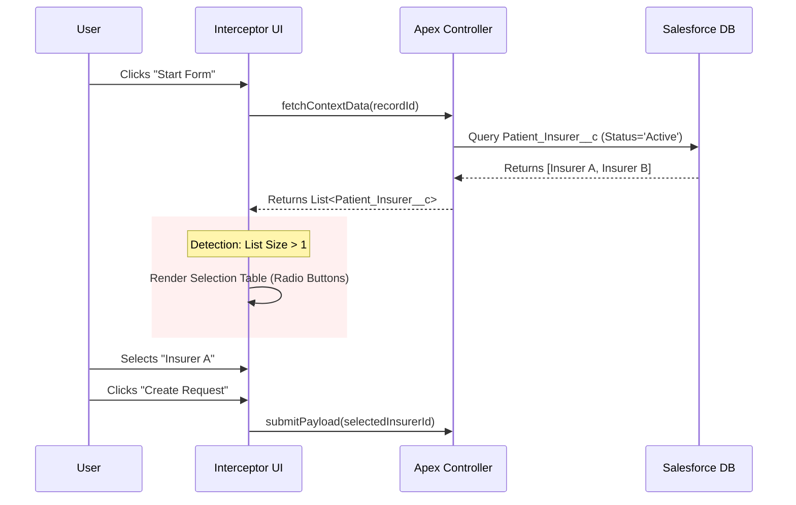
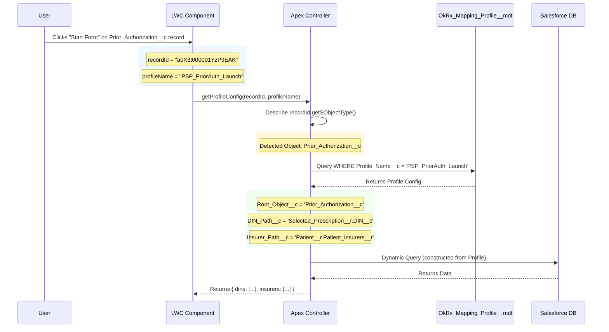
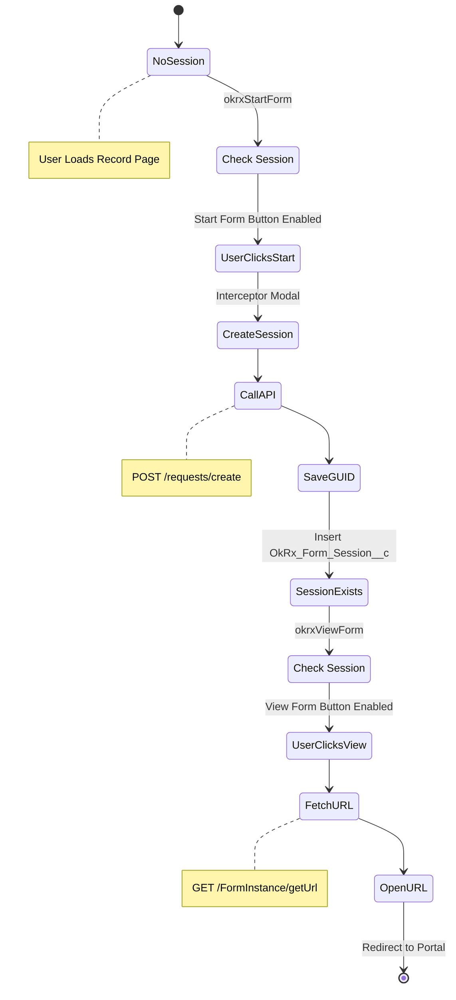
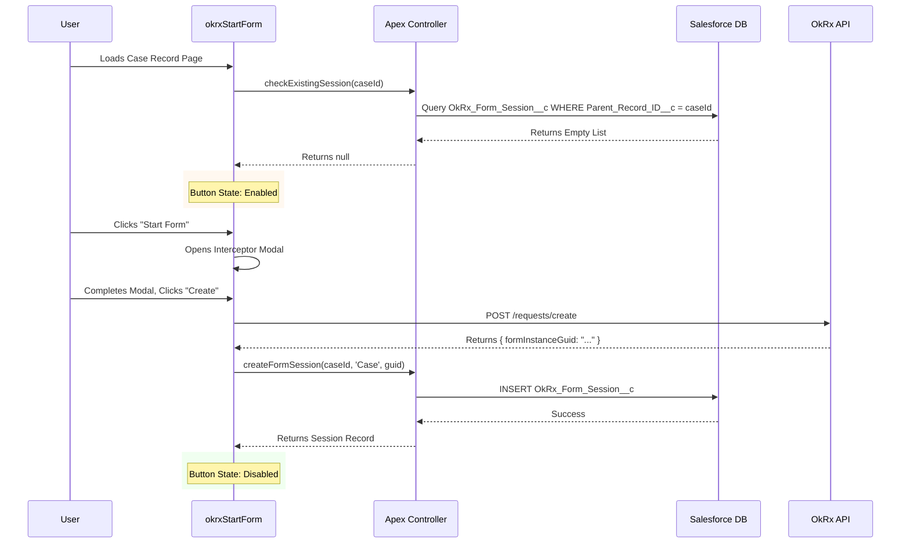
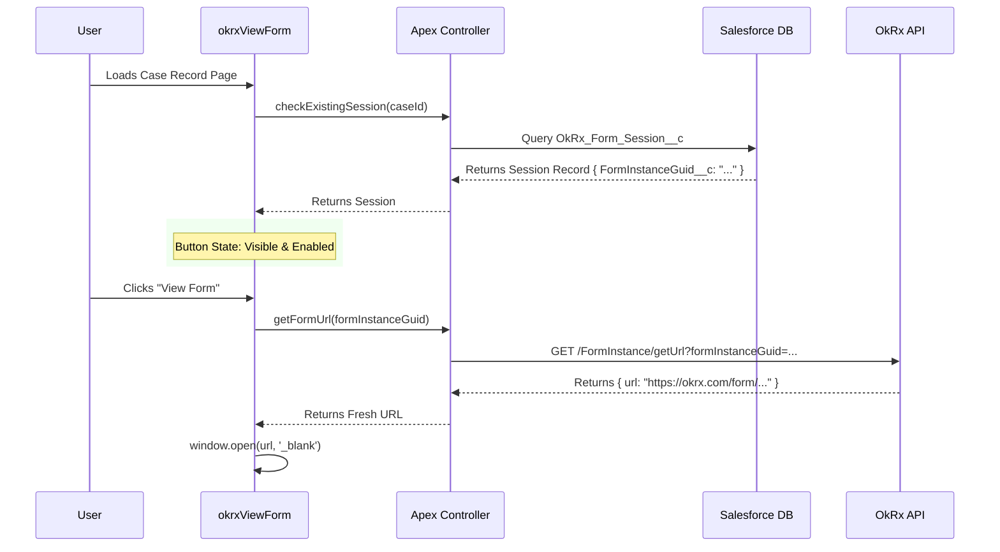
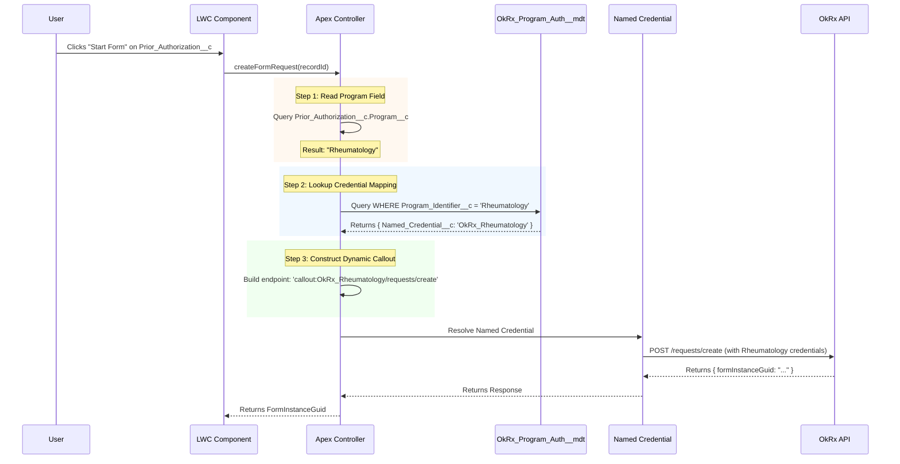

# Technical Specification Document

> **Project:** OkRx Salesforce Connector (AppExchange Managed Package)  
> **Version:** 5.1 (PSP Scenario & Traversal)  
> 🖥️ **UI Prototype:** <a href="https://gemini.google.com/share/f7707f50cf78" target="_blank">Launch Interactive Demo</a>

## 1. Executive Summary

This project aims to build a Salesforce AppExchange Managed Package that integrates the OkRx Forms API. The goal is to replace custom development with a "Universal Connector" that allows clients to generate form instances directly from their Salesforce records, regardless of their unique data schema.

## 2. Project Background & Workflow Narrative

### 2.1 The "Gist" of the Integration

Historically, integrating OkRx required custom code for every client. This Managed Package standardizes that process. The desired workflow is as follows:

*   **Initiation:** The client places a "Start a Form" button on a relevant page (e.g., Patient, Case, or Prior Authorization).
*   **Data Fetch (Phase 1):** When clicked, the app detects the context and sends specific DINs, Insurer Names, and the FormType to the OkRx `/forms/getByMultipleDinsAndInsurers` endpoint.
*   **User Interface:** A generic UI displays the available forms returned by the API.
    *   **Option A:** The user selects a digital form.
    *   **Option B:** The user chooses to upload their own custom PDF.
*   **Deep Mapping & Submission (Phase 2):** When the user proceeds, the app performs a deeper fetch of Salesforce data (Patient details, Address, Prescriber, etc.) to construct the complex `/requests/create` payload.
*   **Persistence:** The resulting `FormInstanceGuid` is stored in Salesforce without modifying the client's schema.
*   **Redirection:** The app calls `/FormInstance/getUrl` and redirects the user to the OkRx portal to complete the form.

## 3. Architectural Solutions to Core Challenges

We have identified 5 critical challenges due to the variability of client data. The architecture solves them as follows:

### Challenge 1: Dynamic Context & Data Relevance (Filtering)

**The Problem:**
Fetching data is not enough; we must fetch the right data from complex data models.

**Scenario (Patient Support Program):** Consider a custom object `Prior_Authorization__c`.
*   The DIN comes from the specific `Prescription__c` record linked to that Prior Auth.
*   The Insurers do not live on the Prior Auth object. They live on the `Patient__c` record (the parent), under a related list `Patient_Insurers__r`.

**Requirement:** The "Start Form" button on the `Prior_Authorization__c` record must be able to "look up" to the Patient and "look down" to their active insurers, while simultaneously "looking across" to the Prescription to get the DIN.

**The Solution: "Filtered Collection Mapping" with Traversal**

We extend the Collection Mapping strategy to include Relationship Traversal and a Filtering Engine.

1.  **Metadata Definition (The "Brain"):**
    The Admin creates a profile named `PSP_PriorAuth_Launch` which is for the process of launching from a PA record.

2.  **Field Mapping Strategy (With Filters & Traversal):**
    We update the Metadata Schema to include a `Collection_Filter_Clause__c` and support relationship paths.

    *   **DIN Mapping (Source Traversal):**
        *   **Root Object:** `Prior_Authorization__c`
        *   **Source Path:** `Selected_Prescription__r` (A lookup to the specific script involved).
        *   **Target Field:** `DIN__c`
        *   **Result:** The engine grabs the DIN for the specific drug being authorized.

    *   **Insurer Mapping (Up-Down Traversal):**
        *   **Root Object:** `Prior_Authorization__c`
        *   **Source Path:** `Patient__r.Patient_Insurers__r` (Go up to Patient, then down to their insurers).
        *   **Field Map:** `InsurerName` -> `Insurer_Company_Name__c`
        *   **Filter:** `Status__c = 'Active'`
        *   **Result:** The engine fetches only the active insurance policies for that patient, ignoring expired ones.

3.  **Runtime Execution Flow:**
    *   **User Action:** User clicks button on `Prior_Authorization__c`.
    *   **Step 1 (Context Fetch):** The Apex engine queries the Root Object to get direct fields and Parent IDs.
        ```sql
        SELECT Selected_Prescription__r.DIN__c, Patient__c
        FROM Prior_Authorization__c
        WHERE Id = :recordId
        ```
    *   **Step 2 (Related List Fetch):** The engine uses the retrieved `Patient__c` ID to query the related insurers separately.
        ```sql
        SELECT Insurer_Company_Name__c
        FROM Patient_Insurer__c
        WHERE Patient__c = :patientId
        AND Status__c = 'Active'
        ```
    *   **Validation:** If the patient has no active insurers found via that path, the UI alerts the user.

### Challenge 2: The "Create Request" Complexity (1-to-Many Relationships)

> **Context:** The `/requests/create` endpoint requires deep data (Patient, Address, Payer). If a patient has multiple addresses or insurance policies, the app cannot guess which one to send.

#### The Problem: Data Ambiguity & Quality

The `/requests/create` endpoint requires a deep, specific JSON payload (Patient, Address, Payer, etc.). Automating this from Salesforce presents two major hurdles:

1.  **1-to-Many Ambiguity:** A Patient might have 3 Addresses or 5 Insurance Policies. The API requires exactly one. The app cannot "guess" which one to send without risking claim rejection.
2.  **Messy Data:** Salesforce records often lack fields required by the API (e.g., a missing `Date of Birth` or `Postal Code`).

#### The Solution: The Interceptor Modal

We introduce a mandatory **"Pre-flight" Modal** that sits between the Form Selection and the API Submission. This UI serves three critical functions:

##### 1. Disambiguation (The 1-to-Many Solver)

**The Logic:**
When the Apex engine executes the "Step 2" query (e.g., fetching `Patient_Insurer__c` records), it may return multiple active results.
*   **Apex Behavior:** The controller returns the *entire list* of found records to the LWC.
*   **LWC Behavior:** The Interceptor UI detects `Insurers.length > 1` and renders a selection table.
*   **Payload Construction:** The LWC takes the `Id` of the selected record to map the final JSON.

**Visual Workflow:**



##### 2. The "Field Set" Strategy (Solving Display Context)

**The Problem:**
We cannot hardcode which columns to show in the selection table. *Client A* needs `Policy_Number__c`, while *Client B* needs `Group_ID__c`.

**The Solution:**
We leverage Salesforce **Field Sets** to delegate this configuration to the Client Admin.

*   **Admin Configuration (XML Metadata):**
    The Admin configures the `OkRx_Interceptor_Display` Field Set.
    ```xml
    <FieldSet xmlns="http://soap.sforce.com/2006/04/metadata">
        <fullName>OkRx_Interceptor_Display</fullName>
        <description>Fields to display in the Interceptor Modal table</description>
        <displayedFields>
            <field>Name</field>
            <isFieldManaged>false</isFieldManaged>
            <isRequired>false</isRequired>
        </displayedFields>
        <displayedFields>
            <field>Policy_Number__c</field>
            <isFieldManaged>false</isFieldManaged>
            <isRequired>false</isRequired>
        </displayedFields>
        <label>OkRx Interceptor Display</label>
    </FieldSet>
    ```

*   **Runtime Logic (LWC Controller):**
    The LWC dynamically iterates the field set to render columns.
    ```javascript
    // LWC Controller Logic
    @wire(getFieldSet, { objectName: 'Patient_Insurer__c', fieldSetName: 'OkRx_Interceptor_Display' })
    wiredFields({ error, data }) {
        if (data) {
            this.columns = data.map(field => ({
                label: field.label,
                fieldName: field.fieldPath
            }));
        }
    }
    ```

##### 3. The "Validation Gate" (Solving Messy Data)

**The Problem:**
The OkRx API requires specific fields (e.g., `Patient.DateOfBirth`) to be present. Salesforce records are often incomplete.

**The Solution:**
The Interceptor UI acts as a firewall.

*   **Blocking Logic:**
    *   If a required field is `null`, the "Submit" button is **Disabled**.
    *   The UI renders the missing field as an **Editable Input** highlighted in **Red**.

**User Correction Flow:**
1.  User sees the red error.
2.  User manually types the missing date.
3.  The UI re-validates. If valid, the "Submit" button becomes **Enabled**.
4.  **Important:** This corrected value is sent to the API but **NOT** saved back to Salesforce.

### Challenge 3: Multiple Entry Points

> **Context:** Clients may want to start forms from custom objects we've never seen.

#### The Problem: Hardcoded Entry Points

**The Reality:**
Clients want to launch forms from different objects depending on their workflow:
*   **Client A:** Launches from `Patient__c` records.
*   **Client B:** Launches from custom `Prior_Authorization__c` records.
*   **Client C:** Launches from standard `Case` objects.

**The Constraint:**
We cannot ship a Managed Package with hardcoded logic for every possible object. We need a solution that works on *any* object without custom development.

#### The Solution: Agnostic Root Objects

Our architecture uses **Dynamic Profile Resolution** to make the LWC and Apex completely object-agnostic. The component works on any record page by reading the `recordId` and looking up the configuration at runtime.

##### Mechanism 1: The "Object Agnostic" LWC

**Core Concept:**
The Lightning Web Component implements `force:hasRecordId`, which automatically provides the current record's ID, regardless of what object it is.

**LWC Implementation:**

```javascript
// okrxFormLauncher.js
import { LightningElement, api, wire } from 'lwc';
import getProfileConfig from '@salesforce/apex/OkRxController.getProfileConfig';

export default class OkrxFormLauncher extends LightningElement {
    @api recordId;  // Automatically populated by Salesforce with the current record ID
    @api profileName; // Design attribute: Admin configures this in App Builder
    
    profileConfig;
    
    @wire(getProfileConfig, { recordId: '$recordId', profileName: '$profileName' })
    wiredProfile({ error, data }) {
        if (data) {
            this.profileConfig = data;
            // Profile config contains: Root Object, Field Mappings, Query Paths
        }
    }
    
    handleStartForm() {
        // LWC doesn't need to know what object this is
        // It just passes the recordId to Apex
    }
}
```

**Key Points:**
*   The LWC *never* hardcodes object names like `Prior_Authorization__c`.
*   The `recordId` could be from *any* object in Salesforce.
*   The component simply reads the `profileName` design attribute (set by the Admin in App Builder) and fetches the configuration.

##### Mechanism 2: Dynamic Profile Resolution

**The Flow:**
When the user clicks "Start Form", the system must determine:
1.  What object is this `recordId` from?
2.  What profile is configured for this context?
3.  What data should be fetched based on that profile?

**Visual Workflow:**



**Apex Implementation:**

```apex
public class OkRxController {
    @AuraEnabled(cacheable=true)
    public static ProfileConfig getProfileConfig(String recordId, String profileName) {
        // Step 1: Describe the record to get its object type
        Id recId = (Id) recordId;
        String objectName = recId.getSObjectType().getDescribe().getName();
        
        // Step 2: Query the Mapping Profile
        OkRx_Mapping_Profile__mdt profile = [
            SELECT Root_Object__c, DIN_Field_Path__c, Insurer_Relationship_Path__c
            FROM OkRx_Mapping_Profile__mdt
            WHERE Profile_Name__c = :profileName
            AND Root_Object__c = :objectName
            LIMIT 1
        ];
        
        // Step 3: Validate the configuration matches the current record
        if (profile.Root_Object__c != objectName) {
            throw new AuraHandledException('Profile mismatch');
        }
        
        return new ProfileConfig(profile);
    }
}
```

##### Mechanism 3: The Dynamic Query Engine

**The Challenge:**
After fetching the Profile configuration, the Apex engine must construct a SOQL query at runtime. The fields to query are stored as *strings* in metadata.

**Dynamic Query Construction:**

```apex
public class OkRxQueryBuilder {
    public static Map<String, Object> fetchContextData(String recordId, OkRx_Mapping_Profile__mdt profile) {
        // Step 1: Build the SELECT clause from Profile configuration
        String dinPath = profile.DIN_Field_Path__c; // e.g., "Selected_Prescription__r.DIN__c"
        String patientPath = profile.Patient_Relationship_Path__c; // e.g., "Patient__c"
        
        // Step 2: Construct the dynamic query
        String query = 'SELECT ' + dinPath + ', ' + patientPath + 
                       ' FROM ' + profile.Root_Object__c + 
                       ' WHERE Id = :recordId';
        
        // Step 3: Execute
        SObject record = Database.query(query);
        
        // Step 4: Extract the data using the same paths
        String dinValue = (String) getNestedFieldValue(record, dinPath);
        String patientId = (String) getNestedFieldValue(record, patientPath);
        
        return new Map<String, Object>{
            'din' => dinValue,
            'patientId' => patientId
        };
    }
    
    private static Object getNestedFieldValue(SObject record, String fieldPath) {
        // Helper to traverse relationship paths like "Patient__r.Name"
        List<String> parts = fieldPath.split('\\.');
        Object currentValue = record;
        
        for (String part : parts) {
            if (currentValue instanceof SObject) {
                currentValue = ((SObject) currentValue).get(part);
            }
        }
        
        return currentValue;
    }
}
```

#### Admin Configuration

**Setup Steps:**
1.  Admin goes to **Setup** > **Custom Metadata Types** > **OkRx Mapping Profile**.
2.  Clicks **New** and creates a profile:
    *   **Profile Name:** `PSP_PriorAuth_Launch`
    *   **Root Object:** `Prior_Authorization__c`
    *   **DIN Field Path:** `Selected_Prescription__r.DIN__c`
    *   **Patient Relationship Path:** `Patient__c`
3.  Admin places the `okrxFormLauncher` LWC on the `Prior_Authorization__c` Lightning Record Page.
4.  In the **Lightning App Builder**, sets the component's `profileName` design attribute to `PSP_PriorAuth_Launch`.

**Result:**
The generic button now "knows" how to fetch data from `Prior_Authorization__c` without any custom code.

### Challenge 4: Persistence & Session Management

> **Context:** This document details the solution for "Challenge 4: Persistence (Storing the GUID)" from the main Technical Specification.

#### The Problem: Schema Pollution

**The Constraint:**
After calling `/requests/create`, the OkRx API returns a `FormInstanceGuid`. We need to store this GUID to enable the "Go to Form" functionality later. However, we cannot ask clients to add custom fields to their objects.

**Why We Can't Use Standard Fields:**
*   **Client A** uses the standard `Case` object. Adding a custom field `FormInstanceGuid__c` requires schema modification.
*   **Client B** uses a custom `Prior_Authorization__c` object. They may have strict governance policies preventing managed packages from adding fields.
*   **AppExchange Security Review:** Modifying client schemas is flagged as a blocker.

#### The Solution: Junction Object Pattern

We ship a custom object `OkRx_Form_Session__c` in the managed package that acts as a "bridge" between the client's records and the OkRx API sessions.

##### The Junction Object Schema

**Object: `OkRx_Form_Session__c`**

```xml
<!-- OkRx_Form_Session__c.object-meta.xml -->
<CustomObject xmlns="http://soap.sforce.com/2006/04/metadata">
    <label>OkRx Form Session</label>
    <pluralLabel>OkRx Form Sessions</pluralLabel>
    <sharingModel>ReadWrite</sharingModel>
    
    <fields>
        <fullName>FormInstanceGuid__c</fullName>
        <label>Form Instance GUID</label>
        <type>Text</type>
        <length>255</length>
        <externalId>true</externalId>
        <unique>true</unique>
    </fields>
    
    <fields>
        <fullName>Parent_Record_ID__c</fullName>
        <label>Parent Record ID</label>
        <type>Text</type>
        <length>18</length>
        <description>Salesforce ID of the Case/Patient/Prior Auth record</description>
    </fields>
    
    <fields>
        <fullName>Parent_Object_Name__c</fullName>
        <label>Parent Object Name</label>
        <type>Text</type>
        <length>100</length>
        <description>API Name of the parent object (e.g., 'Case', 'Prior_Authorization__c')</description>
    </fields>
</CustomObject>
```

**Design Rationale:**
*   **Text ID Instead of Lookup:** Salesforce does not support polymorphic lookups (a single lookup field that can point to *any* object). Using a `Text` field allows us to store the ID of a `Case`, `Patient__c`, or any custom object without schema constraints.
*   **No Form URL Storage:** The form URL is always fetched fresh from the OkRx API via `GET /FormInstance/getUrl?formInstanceGuid={guid}`. This ensures users always get the latest URL and avoids stale data issues.
*   **No Status Field:** The session record's existence is sufficient to indicate that a form was created. Status tracking (if needed) should be handled by the OkRx API, not duplicated in Salesforce.

##### Button Components

The package provides **two separate LWC components** that clients can place independently:
1.  **`okrxStartForm`**: Creates a new form session.
2.  **`okrxViewForm`**: Opens an existing form session.

Clients have flexibility in how they deploy these:
*   **Option A (Single Button):** Place only `okrxStartForm` on the page. After a session is created, the button can dynamically change its label and behavior to "View Form".
*   **Option B (Separate Buttons):** Place both components on different screens or sections. For example, `okrxStartForm` on the Case detail page, and `okrxViewForm` on a custom "Forms" related list.

**Component Interaction Diagram:**



**LWC: `okrxStartForm` Component:**

```javascript
// okrxStartForm.js
import { LightningElement, api } from 'lwc';
import checkExistingSession from '@salesforce/apex/OkRxSessionController.checkExistingSession';
import createFormSession from '@salesforce/apex/OkRxSessionController.createFormSession';

export default class OkrxStartForm extends LightningElement {
    @api recordId;
    @api profileName;
    
    isDisabled = false;
    
    connectedCallback() {
        this.checkIfSessionExists();
    }
    
    async checkIfSessionExists() {
        try {
            const session = await checkExistingSession({ parentRecordId: this.recordId });
            
            if (session) {
                // Session already exists, disable the button
                this.isDisabled = true;
            }
        } catch (error) {
            console.error('Session check failed', error);
        }
    }
    
    handleStartForm() {
        // Open Interceptor Modal
        // After user completes modal and API returns FormInstanceGuid:
        this.saveSession(formInstanceGuid);
    }
    
    async saveSession(guid) {
        try {
            await createFormSession({
                parentRecordId: this.recordId,
                parentObjectName: this.getObjectName(),
                formInstanceGuid: guid
            });
            
            // Disable button after successful creation
            this.isDisabled = true;
        } catch (error) {
            console.error('Failed to save session', error);
        }
    }
}
```

**LWC: `okrxViewForm` Component:**

```javascript
// okrxViewForm.js
import { LightningElement, api } from 'lwc';
import checkExistingSession from '@salesforce/apex/OkRxSessionController.checkExistingSession';
import getFormUrl from '@salesforce/apex/OkRxApiController.getFormUrl';

export default class OkrxViewForm extends LightningElement {
    @api recordId;
    
    existingSession;
    isVisible = false;
    
    connectedCallback() {
        this.checkForSession();
    }
    
    async checkForSession() {
        try {
            this.existingSession = await checkExistingSession({ parentRecordId: this.recordId });
            
            if (this.existingSession) {
                this.isVisible = true;
            }
        } catch (error) {
            console.error('Session check failed', error);
        }
    }
    
    async handleViewForm() {
        try {
            // Always fetch fresh URL from OkRx API
            const url = await getFormUrl({ formInstanceGuid: this.existingSession.FormInstanceGuid__c });
            window.open(url, '_blank');
        } catch (error) {
            console.error('Failed to fetch form URL', error);
        }
    }
}
```

**Apex Controllers:**

```apex
public class OkRxSessionController {
    @AuraEnabled(cacheable=true)
    public static OkRx_Form_Session__c checkExistingSession(String parentRecordId) {
        List<OkRx_Form_Session__c> sessions = [
            SELECT Id, FormInstanceGuid__c
            FROM OkRx_Form_Session__c
            WHERE Parent_Record_ID__c = :parentRecordId
            LIMIT 1
        ];
        
        return sessions.isEmpty() ? null : sessions[0];
    }
    
    @AuraEnabled
    public static OkRx_Form_Session__c createFormSession(
        String parentRecordId, 
        String parentObjectName,
        String formInstanceGuid
    ) {
        OkRx_Form_Session__c session = new OkRx_Form_Session__c(
            Parent_Record_ID__c = parentRecordId,
            Parent_Object_Name__c = parentObjectName,
            FormInstanceGuid__c = formInstanceGuid
        );
        
        insert session;
        return session;
    }
}

public class OkRxApiController {
    @AuraEnabled
    public static String getFormUrl(String formInstanceGuid) {
        // Call OkRx API: GET /FormInstance/getUrl?formInstanceGuid={guid}
        HttpRequest req = new HttpRequest();
        req.setEndpoint('callout:OkRx_API/FormInstance/getUrl?formInstanceGuid=' + formInstanceGuid);
        req.setMethod('GET');
        
        Http http = new Http();
        HttpResponse res = http.send(req);
        
        if (res.getStatusCode() == 200) {
            Map<String, Object> result = (Map<String, Object>) JSON.deserializeUntyped(res.getBody());
            return (String) result.get('url');
        } else {
            throw new AuraHandledException('Failed to fetch form URL: ' + res.getBody());
        }
    }
}
```

##### Runtime Workflow

**Sequence: First Time User (No Session)**



**Sequence: Returning User (Session Exists)**



#### Edge Cases & Considerations

**1. Multiple Sessions for One Record**
*   **Risk:** User clicks "Start Form" twice before the first API call completes.
*   **Mitigation:** Disable the button immediately after the first click. Use a spinner to indicate loading state.

**2. Orphaned Sessions**
*   **Risk:** User creates a form but never submits it. The session record remains forever.
*   **Mitigation:** This is acceptable for audit purposes. The session record provides a history of form creation attempts. Optionally, implement a scheduled Apex batch job to archive sessions older than 90 days.

**3. Deleted Parent Records**
*   **Risk:** User deletes the Case, but the session record remains.
*   **Mitigation:** This is acceptable. Session records provide audit history. Optionally, add a custom trigger to cascade delete sessions when the parent is deleted (using `Parent_Record_ID__c` as the filter).

**4. Stale Form URLs**
*   **Risk:** N/A - This architecture eliminates this risk by always fetching fresh URLs from the OkRx API via `GET /FormInstance/getUrl`.
*   **Benefit:** Users always get the latest form URL, even if OkRx changes their URL structure or implements URL rotation for security.

### Challenge 5: Program-Based Authentication

> **Context:** Different drugs (Programs) use different Client IDs and Secrets.

#### The Problem: Multi-Tenant Credentials

**The Reality:**
OkRx operates multiple "Programs" (drug-specific assistance programs), and each Program has its own set of API credentials:
*   **Program A (Rheumatology):** Client ID: `rh_client_123`, Client Secret: `rh_secret_xyz`
*   **Program B (Oncology):** Client ID: `onc_client_456`, Client Secret: `onc_secret_abc`
*   **Program C (Cardiology):** Client ID: `card_client_789`, Client Secret: `card_secret_def`

**The Constraint:**
A single Salesforce org may handle forms for multiple Programs. We cannot hardcode a single set of credentials. The API callout must dynamically select the correct credentials based on the record's context.

**Why Static Named Credentials Don't Work:**
Salesforce Named Credentials are designed for a single endpoint with a single set of credentials. We need a mechanism to map business logic (e.g., "Which drug is this Prior Auth for?") to the appropriate credential set.

#### The Solution: Map-Based Named Credentials

We use a **Custom Metadata Type** to create a lookup table that maps Program identifiers to Named Credential names. At runtime, the Apex controller reads the Program from the record and dynamically selects the correct credential.

##### Architecture Components

**1. Multiple Named Credentials (One Per Program)**

Each Program gets its own Named Credential in Salesforce Setup.

```xml
<!-- Named Credential: OkRx_Rheumatology -->
<NamedCredential xmlns="http://soap.sforce.com/2006/04/metadata">
    <label>OkRx Rheumatology API</label>
    <endpoint>https://api.okrx.com</endpoint>
    <principalType>NamedUser</principalType>
    <protocol>Password</protocol>
    <username>rh_client_123</username>
    <password>rh_secret_xyz</password>
</NamedCredential>

<!-- Named Credential: OkRx_Oncology -->
<NamedCredential xmlns="http://soap.sforce.com/2006/04/metadata">
    <label>OkRx Oncology API</label>
    <endpoint>https://api.okrx.com</endpoint>
    <principalType>NamedUser</principalType>
    <protocol>Password</protocol>
    <username>onc_client_456</username>
    <password>onc_secret_abc</password>
</NamedCredential>
```

**2. Custom Metadata Type: `OkRx_Program_Auth__mdt`**

This metadata type acts as the "mapping table" between Salesforce field values and Named Credentials.

```xml
<!-- OkRx_Program_Auth__mdt.object-meta.xml -->
<CustomObject xmlns="http://soap.sforce.com/2006/04/metadata">
    <label>OkRx Program Authentication</label>
    <pluralLabel>OkRx Program Authentications</pluralLabel>
    
    <fields>
        <fullName>Program_Identifier__c</fullName>
        <label>Program Identifier</label>
        <type>Text</type>
        <length>100</length>
        <description>The value from the Salesforce record (e.g., 'Rheumatology', 'DRUG-12345')</description>
    </fields>
    
    <fields>
        <fullName>Named_Credential__c</fullName>
        <label>Named Credential</label>
        <type>Text</type>
        <length>100</length>
        <description>API Name of the Named Credential to use (e.g., 'OkRx_Rheumatology')</description>
    </fields>
    
    <fields>
        <fullName>Description__c</fullName>
        <label>Description</label>
        <type>LongTextArea</type>
        <length>1000</length>
    </fields>
</CustomObject>
```

**3. Sample Metadata Records**

```csv
Program_Identifier__c,Named_Credential__c,Description__c
Rheumatology,OkRx_Rheumatology,Credentials for Rheumatology drug assistance program
Oncology,OkRx_Oncology,Credentials for Oncology drug assistance program
DRUG-12345,OkRx_Rheumatology,Specific drug code mapping to Rheumatology program
```

##### Runtime Resolution Flow

**Visual Workflow:**



##### Apex Implementation

**Dynamic Credential Resolution:**

```apex
public class OkRxAuthResolver {
    
    /**
     * Resolves the Named Credential for a given Program identifier
     * @param programIdentifier The value from the Salesforce record (e.g., 'Rheumatology')
     * @return The API name of the Named Credential to use
     */
    public static String resolveNamedCredential(String programIdentifier) {
        if (String.isBlank(programIdentifier)) {
            throw new OkRxException('Program identifier is required for authentication');
        }
        
        // Query the mapping metadata
        List<OkRx_Program_Auth__mdt> mappings = [
            SELECT Named_Credential__c
            FROM OkRx_Program_Auth__mdt
            WHERE Program_Identifier__c = :programIdentifier
            LIMIT 1
        ];
        
        if (mappings.isEmpty()) {
            throw new OkRxException('No authentication mapping found for Program: ' + programIdentifier);
        }
        
        return mappings[0].Named_Credential__c;
    }
    
    /**
     * Builds the complete callout endpoint using the resolved Named Credential
     * @param programIdentifier The Program identifier
     * @param apiPath The API path (e.g., '/requests/create')
     * @return The full callout URL
     */
    public static String buildCalloutEndpoint(String programIdentifier, String apiPath) {
        String namedCredential = resolveNamedCredential(programIdentifier);
        return 'callout:' + namedCredential + apiPath;
    }
}
```

**API Controller with Dynamic Authentication:**

```apex
public class OkRxApiController {
    
    @AuraEnabled
    public static String createFormRequest(String recordId, String profileName) {
        try {
            // Step 1: Fetch the record and extract the Program field
            OkRx_Mapping_Profile__mdt profile = getProfile(profileName);
            String programFieldPath = profile.Program_Field_Path__c; // e.g., 'Program__c'
            
            String query = 'SELECT ' + programFieldPath + ' FROM ' + 
                          profile.Root_Object__c + ' WHERE Id = :recordId';
            SObject record = Database.query(query);
            
            String programIdentifier = (String) record.get(programFieldPath);
            
            // Step 2: Resolve the Named Credential
            String endpoint = OkRxAuthResolver.buildCalloutEndpoint(
                programIdentifier, 
                '/requests/create'
            );
            
            // Step 3: Make the API call
            HttpRequest req = new HttpRequest();
            req.setEndpoint(endpoint);
            req.setMethod('POST');
            req.setHeader('Content-Type', 'application/json');
            req.setBody(buildRequestPayload(record, profile));
            
            Http http = new Http();
            HttpResponse res = http.send(req);
            
            if (res.getStatusCode() == 200) {
                Map<String, Object> result = (Map<String, Object>) 
                    JSON.deserializeUntyped(res.getBody());
                return (String) result.get('formInstanceGuid');
            } else {
                throw new OkRxException('API Error: ' + res.getBody());
            }
            
        } catch (Exception e) {
            throw new AuraHandledException(e.getMessage());
        }
    }
}
```

##### Admin Configuration

**Setup Steps:**

1.  **Create Named Credentials** (Setup > Named Credentials):
    *   Create one Named Credential per Program
    *   Store the Client ID in the Username field
    *   Store the Client Secret in the Password field

2.  **Configure Program Mappings** (Setup > Custom Metadata Types > OkRx Program Authentication):
    *   Click **Manage Records**
    *   Create a new record for each Program:
        *   **Label:** `Rheumatology Program`
        *   **Program Identifier:** `Rheumatology` (must match the value in Salesforce records)
        *   **Named Credential:** `OkRx_Rheumatology` (API name of the Named Credential)

3.  **Update Mapping Profile** (Setup > Custom Metadata Types > OkRx Mapping Profile):
    *   Add a new field: `Program_Field_Path__c`
    *   Set the value to the field path that contains the Program identifier (e.g., `Program__c` or `Drug__r.Program_Name__c`)

##### Edge Cases & Considerations

**1. Missing Program Field**
*   **Risk:** The record doesn't have a Program field populated.
*   **Mitigation:** The Apex controller throws a clear error: "Program identifier is required for authentication." The LWC displays this error to the user.

**2. Unmapped Program**
*   **Risk:** A new Program is added to Salesforce, but no metadata mapping exists.
*   **Mitigation:** The Apex controller throws: "No authentication mapping found for Program: XYZ." Admins must create the mapping before users can submit forms.

**3. Invalid Named Credential**
*   **Risk:** The metadata points to a Named Credential that doesn't exist or has expired credentials.
*   **Mitigation:** Salesforce will throw a callout exception. The error message will indicate "Invalid Named Credential." Admins must verify the credential exists and has valid credentials.

**4. Multiple Programs Per Record**
*   **Risk:** A single Prior Auth covers multiple drugs from different Programs.
*   **Mitigation:** This is a business logic decision. Options:
    *   **Option A:** Force the user to select a single Program in the Interceptor Modal.
    *   **Option B:** Create separate form sessions for each Program (requires multiple API calls).

##### Security Benefits

**Why This Approach is Secure:**

1.  **No Hardcoded Secrets:** Credentials are stored in Salesforce Named Credentials, which are encrypted at rest.
2.  **Separation of Concerns:** Business users configure the Program field. Admins configure the credential mappings. Developers never see the actual credentials.
3.  **Audit Trail:** All API callouts are logged in Salesforce Debug Logs with the Named Credential name (but not the actual credentials).
4.  **Easy Rotation:** When credentials expire, admins only need to update the Named Credential. No code changes required.

##### Testing Strategy

**Unit Test Example:**

```apex
@isTest
private class OkRxAuthResolverTest {
    
    @isTest
    static void testResolveNamedCredential_Success() {
        // Note: Custom Metadata cannot be inserted in tests
        // This test assumes the metadata exists in the org
        
        String result = OkRxAuthResolver.resolveNamedCredential('Rheumatology');
        System.assertEquals('OkRx_Rheumatology', result, 'Should resolve to correct Named Credential');
    }
    
    @isTest
    static void testResolveNamedCredential_NotFound() {
        try {
            OkRxAuthResolver.resolveNamedCredential('NonExistentProgram');
            System.assert(false, 'Should have thrown exception');
        } catch (OkRxException e) {
            System.assert(e.getMessage().contains('No authentication mapping found'), 
                         'Should throw mapping not found error');
        }
    }
    
    @isTest
    static void testBuildCalloutEndpoint() {
        String endpoint = OkRxAuthResolver.buildCalloutEndpoint('Rheumatology', '/requests/create');
        System.assertEquals('callout:OkRx_Rheumatology/requests/create', endpoint, 
                           'Should build correct callout URL');
    }
}
```

## 4. Functional Specifications & API Logic

### 4.1 Step 1: Search & Selection (The "Interceptor")

**Trigger:** User clicks "Start Form".

**Logic:**
1.  **Resolve Profile:** LWC reads the "Profile Name".
2.  **Fetch Data:** Apex executes the Filtered queries defined in Metadata.
3.  **API Call:** `POST /forms/getByMultipleDinsAndInsurers`

```json
{
  "Dins": [ "02240555" ], // Filtered to specific drug
  "Insurers": [ { "InsurerName": "Sun Life" } ], // Filtered to active
  "FormType": "PRIORAUTH"
}
```

**UI Render:** Display forms list.

### 4.2 Step 2: Instance Creation (The "Deep Map")

**Trigger:** User selects Form + Specific Insurer Record -> Click "Create".

**Logic:**
1.  **Fetch Phase 2 Data:** Query full dataset based on `OkRx_Field_Map__mdt`.
2.  **Resolve Conflicts:** Use the User Selected Insurer from Step 1 to populate `Request.Patient.Payer` fields.
3.  **API Call:** `POST /requests/create`

```json
{
  "Din": "0123456",
  "FormGuid": "00000-000...", // Selected Form GUID
  "InsurerGuid": "...",
  "Request": {
     "ExternalFormIdentifier": "SF-CASE-1001",
     "FormType": "PRIORAUTH",
     "FormInstance": {
       "Patient": {
          "FirstName": "John",
          "Payer": { ... }     // Mapped from Selected Insurer
       }
     }
  }
}
```

4.  **Save:** Store GUID in `OkRx_Form_Session__c`.

### 4.3 Special Case: Custom PDF Upload

**Logic:**
If the user selects "Upload PDF":
1.  Call `/requests/create` using the Dummy GUID: `10000000-0000-0000-0000-000000000000`.
2.  Take the new GUID returned by that call.
3.  Call `POST /FormInstance/uploadStandardForm` with the file payload.

### 4.4 Step 3: Redirection

**Trigger:** Button detects existing Session record.

**Logic:**
1.  Call `GET /FormInstance/getUrl?formInstanceGuid={GUID}`.
2.  Open link in new tab.

## 5. Data Model

### 5.1 Custom Object: `OkRx_Form_Session__c`

*   `FormInstanceGuid__c` (Text, 255): External ID.
*   `Parent_Record_ID__c` (Text, 18): Indexed. Links to client record.
*   `Parent_Object_Name__c` (Text, 100): For reporting.

### 5.2 Configuration Metadata

*   `OkRx_Mapping_Profile__mdt`: Defines the "Context" (Root Object).
*   `OkRx_Field_Map__mdt`: Maps JSON paths to Salesforce fields per profile.
*   `Collection_Filter_Clause__c` (Text, 255): New Field. Stores the WHERE clause for list filtering (e.g., `Status__c = 'Active'`).
*   `OkRx_Program_Auth__mdt`: Maps Programs to Named Credentials.

## 6. Deliverables

*   **Managed Package:** Full code and metadata.
*   **Admin Guide:** Instructions for the "Configuration Wizard" (Setting up Profiles and Field Maps).
*   **Security Review Pack:** Checkmarx Scans & False Positives.
